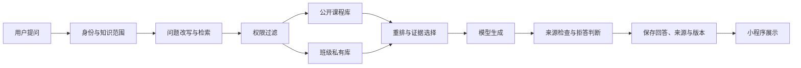

# 小程序产品与迁移方案

版本：`v0.1`  
日期：2026-08-13  
状态：前期骨架

> ⚠️ **作废说明**：本文描述的旧版"问答/学习/作业"规划已于 2026-08-17 被用户明确作废。现行小程序严格按已上线课程网站（ai4orgnization-theory.cn）同步制作，见 `docs/05-模块映射与微信提审合规清单.md`。本文件仅作历史参考，不再指导实现。

## 一、产品定位

小程序是课程的移动入口，网站和小程序共用内容、账号、数据库、知识库和 AI 服务。网站适合公开传播、长文阅读和教师管理；小程序优先处理随时提问、课程学习、知识检索、作业提交和个人记录。

这不是把网页缩窄后逐页复制。网站现有六个一级栏目在小程序中重新组合：

| 网站功能 | 小程序入口 | 处理方式 |
|---|---|---|
| 首页 | 学习 | 课程定位、本周内容和主要入口合并展示 |
| 课程大纲 | 学习 > 课程详情 | 保留周次、目标、材料和活动 |
| 课程教材 | 学习 > 三条内容线 | 改成适合手机连续阅读的章节列表 |
| 知识库 | 知识库 | 保留搜索、概念和来源；增加“问 AI”入口 |
| 教学平台 | 作业、我的 | 登录、班级、作业、反馈和个人记录拆开呈现 |
| 关于 | 我的 > 关于课程 | 教师、团队、规则和联系方式放在二级页 |
| 阅读伴侣 | 问答、章节内提问 | 由局部演示升级为独立多轮问答 |

## 二、底部导航

底部固定五个模块：

1. 问答：默认首页。用户可以新建对话、查看历史、切换知识范围并核对来源。
2. 学习：本周任务、课程大纲、三条教材线和阅读进度。
3. 知识库：理论概念、课程文献、AI 素养资料和班级补充材料。
4. 作业：任务、草稿、AI 形成性反馈、提交版本和教师确认结果。
5. 我的：用户身份、班级、对话历史、学习记录、隐私和反馈。

布局参考 ima 的“底部模块 + 顶部功能页”，但视觉继续使用课程平台的编辑风格：黑色主色、粉色强调、纸张底色和较强的标题层级。

## 三、问答功能

### 3.1 一次回答要保存什么

- 用户与班级；
- 对话与消息顺序；
- 用户问题和模型回答；
- 检索到的资料片段、来源位置和相关分数；
- 模型、提示词和知识库版本；
- 生成耗时、token 用量和错误状态；
- 用户反馈：有帮助、引用不对、没有回答问题；
- 必要的人工修订与审核记录。

### 3.2 RAG 回答路径

权限过滤必须在检索阶段完成。模型不能先读取别的班级资料，再依靠提示词要求它“不要泄露”。

### 3.3 历史记忆的边界

短期记忆使用当前对话中最近若干轮消息。长期记忆只保存经过定义的学习偏好、已完成单元和用户主动保留的笔记，不把所有聊天自动压成“用户画像”。用户应能查看、删除或关闭长期记忆。

## 四、作业和反馈

每次提交生成一个新版本，旧版本不可覆盖。AI 作业教练可以在提交前按量规给出形成性反馈，教师端能看到原文、AI 反馈、学生修改和各版本差异。正式评语与成绩仍由教师确认。

学生只能读取自己的提交。教师和助教的访问范围由班级角色决定，助教默认不能确认正式成绩。所有成绩修改、数据导出和权限变更进入审计日志。

## 五、阶段安排

### 阶段 A：现在完成

- 注册或确认小程序主体与 AppID；
- 导入本地骨架，确定名称、类目和视觉方向；
- 准备备案、隐私、域名和服务器材料；
- 冻结账号、班级、问答、作业和权限数据模型；
- 确认哪些网站内容允许公开进入小程序。

### 阶段 B：网站接近稳定后

- 把课程内容改成统一内容源，网站和小程序通过 API 读取；
- 接入真实登录、班级、作业与个人历史；
- 接入 RAG 服务和回答评测；
- 完成文件上传、教师复核和正式成绩确认；
- 做跨用户、跨班级、离线、弱网和模型故障测试。

### 阶段 C：试用与提审

- 使用两个测试班级做数据隔离检查；
- 用不少于 30 个课程问题回归检验来源支持率与拒答；
- 完成备案、隐私保护指引、用户协议和注销路径；
- 发布体验版，由课程团队和目标学生走完整学习流程；
- 修复问题后提交平台审核。

## 六、当前判断

现在适合做账号与合规准备、页面骨架、数据模型和接口合同，不适合提前复制所有网页，也不适合把演示问答直接连到大模型后称为 RAG。知识来源、切分方法、权限过滤、引用展示和评测没有走通前，问答只能算模型对话。

