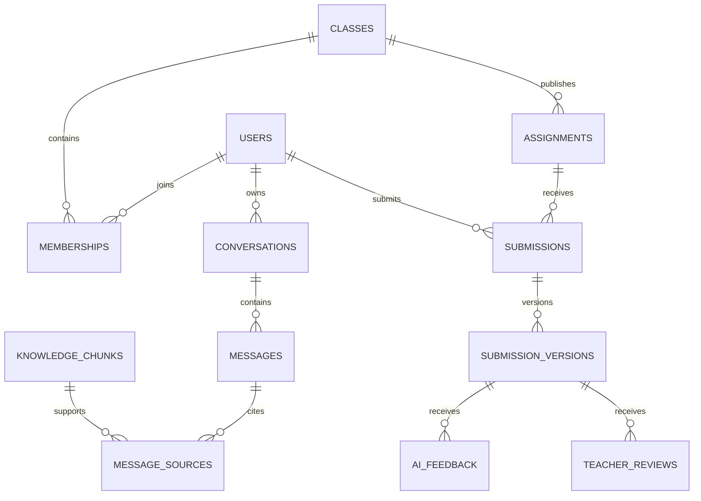
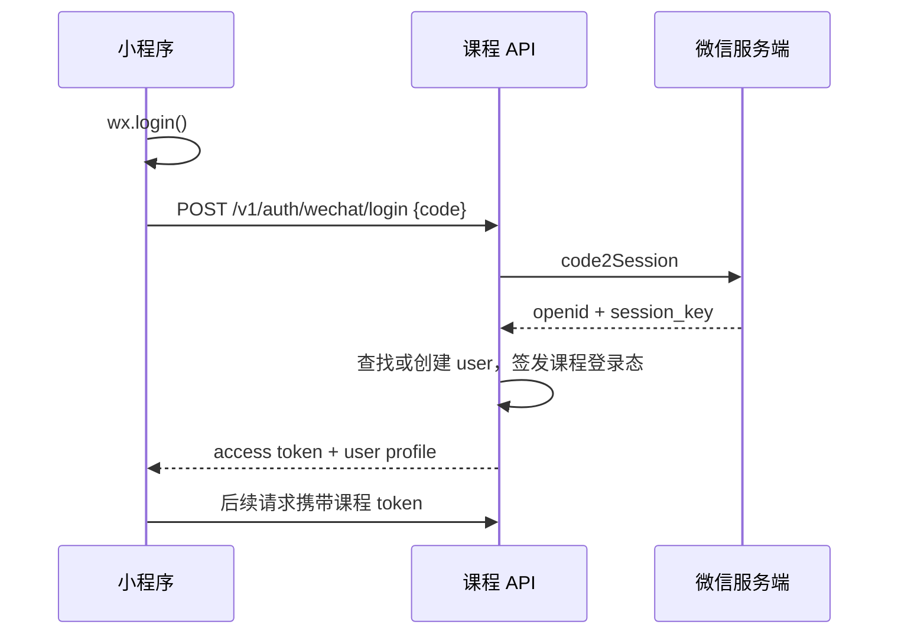

# 小程序数据与接口草案

版本：`v0.1`

> ⚠️ **作废说明**：本文的 `conversations` / `assignments` / `submissions` 数据表与接口属于旧版"问答/作业"规划，已于 2026-08-17 作废，对应小程序代码（`services/api.js`、`mock/data.js`）已删除。现行小程序仅保留微信登录（`POST /v1/auth/wechat/login`），课程与知识内容由 `<web-view>` 内嵌课程网站承载。本文件仅作历史参考。

## 一、数据边界

公开内容与教学数据分区保存。所有私有查询同时检查用户、角色、班级和对象归属，不能只靠前端隐藏入口。



## 二、建议数据表

| 表 | 主要字段 | 说明 |
|---|---|---|
| `users` | `id`, `wechat_openid`, `unionid`, `display_name`, `status` | `openid` 只在服务端使用 |
| `classes` | `id`, `course_id`, `term`, `name`, `status` | 班级是私有数据的基本边界 |
| `memberships` | `user_id`, `class_id`, `role`, `joined_at` | 角色包括学生、助教、教师 |
| `conversations` | `id`, `user_id`, `class_id`, `title`, `memory_mode` | 对话归个人所有 |
| `messages` | `id`, `conversation_id`, `role`, `content`, `model_version`, `knowledge_version` | 保存消息顺序和生成版本 |
| `message_sources` | `message_id`, `chunk_id`, `rank`, `score`, `locator` | 保存实际使用的来源 |
| `knowledge_documents` | `id`, `domain`, `class_id`, `visibility`, `version`, `source_uri` | 区分公开域和班级域 |
| `knowledge_chunks` | `id`, `document_id`, `content`, `embedding`, `locator` | pgvector 检索对象 |
| `assignments` | `id`, `class_id`, `title`, `rubric_version`, `due_at` | 教师发布 |
| `submissions` | `id`, `assignment_id`, `user_id`, `status` | 每名学生每份作业一个主体记录 |
| `submission_versions` | `id`, `submission_id`, `version`, `content`, `file_key`, `submitted_at` | 追加版本，不覆盖 |
| `ai_feedback` | `id`, `submission_version_id`, `rubric_version`, `content`, `model_version` | 形成性反馈 |
| `teacher_reviews` | `id`, `submission_version_id`, `reviewer_id`, `comment`, `grade`, `confirmed_at` | 正式结果由教师确认 |
| `audit_logs` | `actor_id`, `action`, `object_type`, `object_id`, `metadata`, `created_at` | 权限、成绩、导出和删除操作留痕 |

## 三、身份与登录



`session_key` 不返回小程序。正式版登录态建议使用短期 access token 与可撤销的 refresh session，服务端记录会话设备、过期时间和撤销状态。

## 四、接口合同

### `POST /v1/auth/wechat/login`

请求：

```json
{ "code": "wx.login 返回的一次性凭证" }
```

响应：

```json
{
  "token": "课程平台登录态",
  "user": {
    "id": "usr_123",
    "name": "用户显示名",
    "role": "student",
    "classId": "cls_2026_a",
    "className": "2026 秋季班"
  }
}
```

### `POST /v1/conversations/{id}/messages`

请求：

```json
{
  "question": "用户问题",
  "domain": "course-public",
  "clientMessageId": "用于幂等处理的客户端消息 ID"
}
```

响应至少包含：

```json
{
  "id": "msg_123",
  "role": "assistant",
  "content": "回答正文",
  "sources": [
    { "id": "src_1", "title": "资料标题", "locator": "章节或页码" }
  ],
  "modelVersion": "model-name@version",
  "knowledgeVersion": "kb-2026-08-13"
}
```

### `POST /v1/assignments/{id}/submissions`

服务端根据当前用户和历史记录生成版本号。客户端传入的 `version` 只作冲突检查，不能决定最终版本。重复请求使用幂等键，避免弱网下产生两份相同提交。

## 五、权限检查

| 动作 | 学生 | 助教 | 教师 |
|---|---|---|---|
| 读取公开内容 | 是 | 是 | 是 |
| 读取本人对话 | 是 | 本人 | 本人 |
| 读取他人对话 | 否 | 默认否 | 仅经课程规则授权 |
| 读取本人作业 | 是 | 本人 | 本人 |
| 读取班级提交 | 否 | 授权班级 | 授权班级 |
| 生成 AI 反馈 | 本人作业 | 授权班级 | 授权班级 |
| 确认正式成绩 | 否 | 默认否 | 是 |
| 导出班级数据 | 否 | 默认否 | 按管理员授权 |

所有权限在 API 和数据库查询中执行。小程序页面只负责改善体验，不承担安全隔离。

