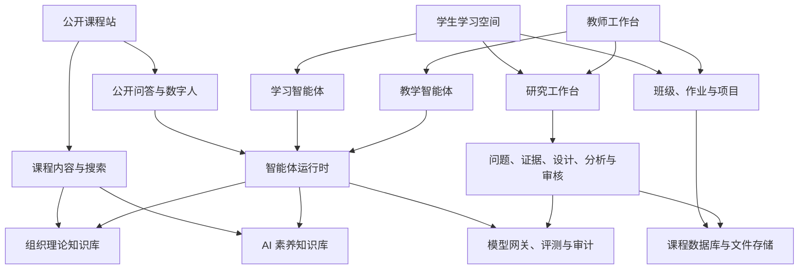

# 《人工智能与组织理论》课程智能体平台总体方案

版本：`v0.3`  
日期：2026-08-12  
性质：用于课程团队讨论的工作稿

## 一、项目定位

这套平台要同时解决四件事：让外部读者看懂课程，让学生在课程中学习和练习，让学生完成可复核的社会科学研究，让教师能管理作业、研究项目和正式评价。课程网站只是入口，课程内容、知识库、智能体、研究流程和教学管理共同组成产品。

课程的辨识度不能只来自数字人形象。它应当体现在学习方法上：学生用组织理论理解智能体，也用智能体重新观察组织。每个教学单元都尽量沿着同一条路径展开：提出一个组织问题，学习相关理论，设计或使用智能体进行实验，提交证据，再反思人与智能体如何分工。

暂定一句内部定位：

> 一门把组织理论变成可观察、可设计、可实验对象的本科课程。

这句话只用于统一团队判断，不直接作为对外宣传语。

## 二、目标用户与主要任务

| 用户 | 主要任务 | 平台需要提供什么 |
|---|---|---|
| 访客 | 了解课程、试读教材、体验公开问答 | 清楚的课程介绍、可搜索内容、来源可追溯的问答 |
| 学生 | 预习、提问、做实验、提交作业、修改作品 | 学习路径、知识问答、作业教练、提交与反馈、个人作品记录 |
| 教师 | 备课、发布任务、查看学习情况、给出正式评价 | 内容管理、班级管理、量规、AI 辅助反馈、人工复核入口 |
| 助教 | 答疑、初审、整理共性问题 | 问题队列、批注工具、反馈校准、权限受控的数据视图 |
| 课程建设者 | 更新教材、知识库、智能体与品牌材料 | 版本管理、发布流程、评测集、变更记录 |

## 三、平台分层

平台分成四个面向用户的界面，底层共用课程内容、知识库和智能体服务。



### 3.1 公开课程站

一级导航确定为六项：首页、课程大纲、课程教材、知识库、教学平台、关于。首页不堆满所有功能，只完成四个任务：说明课程研究什么，说明学生怎么学，展示本学期的学习路径，引导读者进入大纲、教材或教学平台。智能体不再单列一级栏目，而是嵌入知识库问答、教材伴读、作业教练和教师工作台，使角色与具体学习任务绑定。

课程教材采用章节化在线阅读，支持全文搜索、章节目录、引用链接、版本标记和相关阅读。教材区同时维护三条内容线：《人工智能与公共组织》课程教材、人工智能基础素养教材、AI 实操指南。后两条内容线与“AI 素养培训：课程体系建设与落地”项目共享内容源，但在本平台中按本科课程的学习任务重新编排。

知识库面向访客展示可公开的组织学文献目录、概念索引和来源信息；登录学生可以使用带来源的课程问答。公开问答默认只检索公开知识库，不读取班级材料。组织理论导师、AI 素养导师和作业教练在 MVP 阶段只对登录学生开放。

### 3.2 学生学习空间

学生登录后看到本周任务，而不是复杂的功能菜单。建议首页按“本周学习—需要完成—收到反馈—继续修改”组织。主要功能包括：

- 查看课程进度、教材和学习资料；
- 向课程智能体提问，并查看回答所依据的段落；
- 领取作业或项目任务，查看量规；
- 提交文本、文件、图片或链接；
- 获取形成性反馈，修改后再次提交；
- 查看教师确认后的评价与个人作品记录。

### 3.3 教师工作台

教师端负责课程运行，不追求把所有操作改成对话。高频、可批量的任务应保留结构化界面；适合探索和生成的任务再交给 AI 助手。教师可以管理班级与学生、发布作业、编辑量规、查看提交、比较多智能体意见、确认反馈、维护课程资料并查看共性问题。

### 3.4 社会科学研究工作台

研究工作台让学生把课程问题推进为研究项目。它至少保存研究问题、来源与证据、主张、假设、研究设计、数据与分析产物、仿真实验、执行轨迹和审核记录。学生可以走现实研究或仿真研究路径，两条路径共用项目、证据和审核规则。

MVP 只做一个纵向切片：创建项目、登记材料、形成假设与设计、上传分析产物、提交结论、接受反例评审和教师确认、导出研究包。自动数据采集、大规模社会仿真和一键论文生成不进入首期。完整方案见[研究平台与数字公共治理培养方案](05-研究平台与数字公共治理培养方案.md)。

## 四、课程内容模型

平台内容不按“网页文章”管理，而按可复用的课程对象管理。

| 对象 | 最少字段 | 用途 |
|---|---|---|
| 教学单元 | 主题、学习目标、先修内容、材料、活动、产出 | 组织每周课程 |
| 理论概念 | 定义、提出者、适用边界、争议、关联概念、来源 | 组织理论知识库 |
| AI 概念 | 定义、例子、风险、操作练习、来源 | AI 素养知识库 |
| 案例 | 情境、角色、组织问题、材料、讨论题 | 课堂讨论与智能体实验 |
| 实验 | 输入、角色、步骤、观察项、证据、反思题 | 把理论转成可操作活动 |
| 作业 | 目标、要求、提交格式、量规、样例、截止时间 | 教学管理与评审 |
| 量规 | 维度、表现等级、证据要求、常见误区 | 保证反馈一致性 |
| 来源 | 标题、作者、年份、链接或文件、许可、可见范围 | 引用与知识库追溯 |

建议给每个教学单元配置一条完整学习链：

`组织问题 → 理论解释 → AI/智能体实验 → 学生产出 → 证据评审 → 反思`

如果一个平台功能不能支撑这条链中的任何环节，应当暂缓开发。

## 五、知识库设计

### 5.1 两个知识域，一套连接方式

知识库分为组织理论和 AI 素养两个知识域，但不能做成彼此孤立的资料夹。二者通过“课程问题”连接。例如“算法管理如何改变控制”会同时连接组织控制理论、算法管理案例、模型局限和审计方法。

组织理论知识库的首批范围可从课程大纲反推，不宜一次收全。每个概念至少保留原始出处、课程解释、适用边界和一个案例。AI 素养知识库至少覆盖大模型基本原理、提示与上下文、RAG、工具调用、智能体工作流、评估、安全、版权与数据使用。

### 5.2 知识处理流程

```text
原始资料登记
  → 版权与可见范围确认
  → 文本清理和结构切分
  → 课程团队标注概念、来源与适用边界
  → 建立检索索引
  → 用课程问题评测回答
  → 发布到公开库或班级库
```

知识条目要有版本号和负责人。教材更新后，问答系统需要知道哪些旧回答可能失效。公开资料、校内资料、学生作品和教师私有资料分别建立访问范围，不允许只靠提示词隔离。

### 5.3 问答质量标准

课程问答至少满足以下要求：

- 回答标出引用的教材章节或资料；
- 找不到依据时明确说“课程资料中没有足够信息”；
- 把事实、课程观点和模型推断分开；
- 对同一组标准问题进行回归测试；
- 保存模型、提示词、知识库版本和学生反馈，便于复查。

## 六、智能体体系

首期不宜同时上线很多人物。先做少量角色，确保每个角色有清楚的教学责任。

| 智能体 | 面向谁 | 主要职责 | 首期优先级 |
|---|---|---|---|
| 课程导航员 | 访客、学生 | 解释课程、定位章节、回答课程规则 | P0 |
| 组织理论导师 | 学生 | 解释概念、比较理论、追问适用边界 | P0 |
| AI 素养导师 | 学生 | 解释 AI 概念、指导练习、提醒风险 | P0 |
| 作业教练 | 学生 | 在提交前按量规提问和反馈，不直接代写 | P0 |
| 标准评审智能体 | 教师、助教 | 按量规检查证据，给出分项建议 | P1 |
| 反例评审智能体 | 教师、助教 | 寻找论证漏洞、遗漏和替代解释 | P1 |
| 教学助理 | 教师 | 起草任务、整理共性问题、分析提交情况 | P1 |
| 项目协作团队 | 学生 | 为课程项目分配研究、设计、测试等角色 | P2 |

“教师数字分身”建议作为交互外观和话语入口，不等于一个无边界的万能智能体。它调用课程导航、理论问答等能力，回答中区分“课程资料记载”“教师已确认观点”和“模型生成建议”。涉及教师个人立场而资料不足时，不模拟教师下判断。

### 6.1 作业反馈规则

参考项目采用两个 Agent 并行评审并取较高分。这里不建议照搬。较高分机制容易鼓励分数膨胀，也无法处理两个评审给出不同理由的情况。

本课程建议采用以下流程：

1. 标准评审智能体按量规提取证据并给出分项建议；
2. 反例评审智能体检查遗漏、替代解释和引用问题；
3. 汇总器只整理一致点与分歧，不擅自决定正式分数；
4. 学生先收到可修改的形成性反馈；
5. 教师或助教确认总结性评价和正式成绩。

系统保存每次评审使用的量规版本、模型版本、引用证据和人工修改记录。

## 七、数字 IP 与数字人

数字 IP 的任务是帮助学生识别课程、理解角色并愿意反复使用，不只是做一张吉祥物图片。设计前先确定四件事：

- 它与“组织”有什么关系；
- 它在课程中承担什么角色；
- 它能说什么，不能代表教师说什么；
- 它如何进入网页、教材插图、短视频和活动物料。

首期建议采用“一个主 IP + 多个功能身份”的体系。主 IP 保持稳定的轮廓、色彩和性格；进入不同智能体时，通过徽章、道具、界面色或动作区分组织理论导师、AI 素养导师和作业教练。这样比为每个功能重新造一个角色更容易形成记忆。

数字人的成熟度分三步：

1. 静态形象与文字问答；
2. 口型、语音和有限动作；
3. 直播或实时视频对话。

MVP 只做第 1 步。语音和视频会明显增加费用、延迟、内容审核和肖像授权问题，等文字问答质量稳定后再评估。

## 八、技术方案

### 8.1 总体选择

首期采用模块化单体和单仓库：一个 Web 应用承载公开站与登录后的工作台，一个 FastAPI 后端承载业务 API、智能体运行时和知识检索。部署使用 Docker Compose，先适配正在搭建的单台云服务器。

建议技术组合：

- Web：Next.js + TypeScript + Tailwind CSS；
- API：FastAPI + Pydantic + SQLAlchemy；
- 数据库：PostgreSQL + pgvector；
- 文件：S3 兼容对象存储，单机阶段可用 MinIO；
- 内容：Markdown/MDX，课程元数据使用 YAML；
- 检索：PostgreSQL 全文检索与向量检索混合；
- 模型：统一模型网关，适配 OpenAI 兼容接口和其他选定供应商；
- 部署：Docker Compose + 反向代理 + HTTPS；
- 监控：请求日志、错误跟踪、模型调用费用、延迟和评测结果。

Next.js 不是最终锁定项。如果教材团队更熟悉 Quarto，可以用 Quarto 生成教材，再由主站统一导航和身份。技术选型在课程内容样例、编辑习惯和服务器约束确认后冻结。

### 8.2 内容发布边界

核心教材、大纲、案例模板和量规模板以仓库中的结构化文本为准，由课程建设者审核和发布。数据库保存班级运行数据，包括截止时间、班级说明、发布状态、提交和评价。教师在工作台中选择已经发布的内容版本，并填写班级专属说明；MVP 不提供直接修改公开教材的完整 CMS。

这条边界把“课程内容版本”和“本学期如何使用内容”分开。后续如果加入网页编辑器，发布时也必须生成可审查的内容版本，不能让数据库中的草稿无记录地覆盖教材源码。

### 8.3 权限与数据边界

至少设置访客、学生、助教、教师、课程管理员五类角色。公开课程内容可匿名访问；班级名单、提交、成绩、对话记录和教师私有材料需要登录，并按班级隔离。模型 API Key 只能保存在服务端。导出、删除、备份和恢复都要有操作记录。

MVP 使用同一主域名下的路由分区：公开站为 `/`，学生空间为 `/learn`，教师工作台为 `/teach`，管理入口为 `/admin`。公开首页和教材页始终提供“进入课程”入口；未登录用户先完成身份验证，再回到原目标页面。

账户需要覆盖创建、入班、转班或退课、停用、密码重置和学期结束归档。助教只能访问被授权班级，能编辑反馈草稿但不能确认正式成绩，除非课程负责人单独授予该权限。

### 8.4 非功能要求

- 手机端能完成阅读、提问和提交；
- 公开页面支持搜索引擎收录；
- 常用页面在普通校园网络下可用；
- 智能体回答支持流式输出、停止生成和失败重试；
- 关键教学流程有审计记录和备份；
- 模型不可用时，教材、任务和提交功能仍能使用；
- 所有智能体都有限额、超时和敏感操作确认。

## 九、建设节奏

### 阶段 0：课程与产品定义

完成课程正式名称、目标学生、课程大纲、首批教学单元、知识来源、作业样例、评分规则、品牌方向和基础设施清单。选择一个教学单元做纸面演练，确认学习链完整。

### 阶段 1：MVP

上线公开课程站、在线大纲、教材样章、三类学习智能体、登录与班级、一个作业流程、研究工作台纵向切片、教师复核和基础数字 IP。先让一个真实班级完成一轮“学习—提问—研究—提交—反馈—修改”。

### 阶段 2：学期试运行

补充教材与知识库，加入多智能体评审、项目协作、共性问题分析、现实材料采集和作品记录。根据真实对话、作业和研究包调整提示词、量规和界面。

### 阶段 3：对外开放

明确公开内容许可和访问边界，补充限流、监控、备份、安全测试、内容审核和运营机制。受控试点通过后，再增加仿真配置、运行、回放与敏感性分析，并决定是否加入语音数字人、公开项目展厅和校外课程。

### 阶段 4：数字公共治理专业培养平台

把经过课程验证的教材、研究流程、教师 Skill、现场工作室和仿真实验室分配到专业课程群。到这一阶段再建设多课程、多教师、跨学期作品档案和毕业项目管理，不在课程 MVP 中提前实现。

## 十、判断项目是否成功

首学期不以访问量作为主要指标。建议观察：

- 学生能否独立找到本周材料和任务；
- 问答引用是否准确，教师抽查错误率如何；
- 作业反馈是否促成第二次修改；
- 教师花在重复答疑和格式性批改上的时间是否减少；
- 学生能否用组织理论解释智能体协作，而不只会调用工具；
- 课程内容、量规和知识库是否能由团队持续更新。

指标的具体阈值要等班级规模和教学安排确定后再设定。
