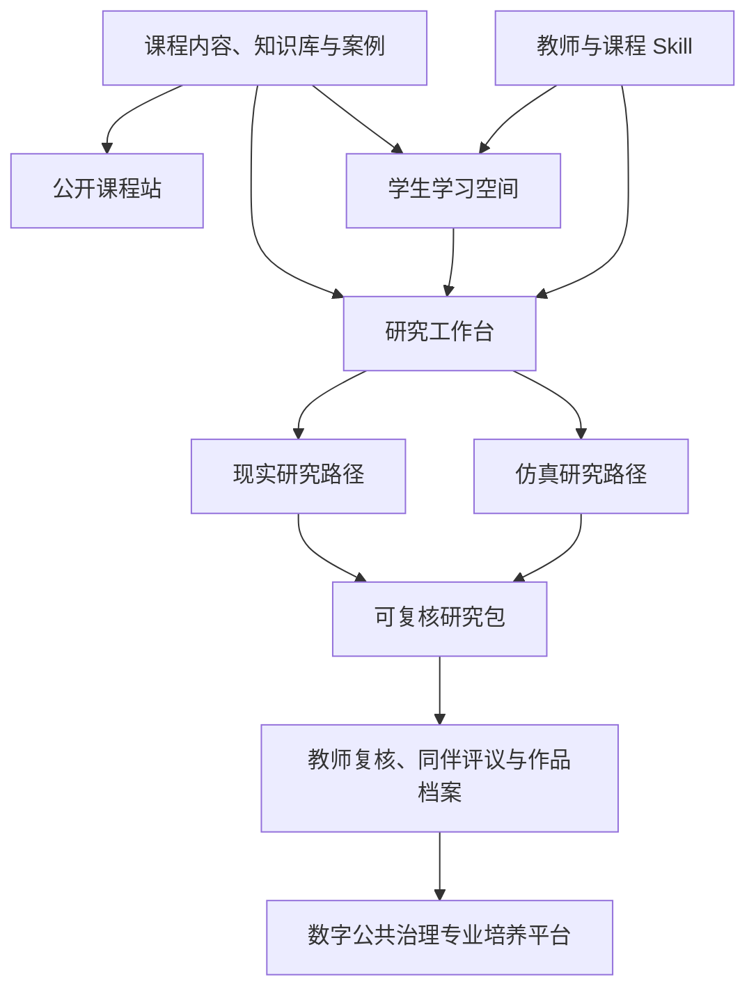

# 从课程智能体平台到数字公共治理培养平台

版本：`v0.1`  
日期：2026-08-09  
性质：根据导师设想整理的项目转化稿

## 一、这次规划增加了什么

现有方案已经覆盖公开课程站、在线教材、教学工作台、知识库、教师数字分身和学习智能体。下一步需要补上“研究工作台”，让学生把课堂问题推进为可以检查、复现和修改的研究项目。

研究工作台不另建一套孤立系统。它与课程教材、知识库、班级和教师工作台共用身份、内容版本、模型入口和审计记录；研究对象与执行过程则采用独立协议，避免一段聊天记录成为项目的唯一载体。

课程平台先承担试验任务。等真实班级跑通后，再把已经验证的课程内容、研究流程和治理规则扩展为数字公共治理专业的培养平台。两者的关系是“课程先验证，专业平台再复用”，不是同时建设两个大而全的产品。

## 二、产品关系



课程站负责公开传播和教材阅读，学习空间负责每周任务与作业，研究工作台保存研究问题、证据、设计、分析产物和审核记录。教师数字分身可以作为入口，但不能代替研究对象协议，也不能代表教师确认未经审核的结论。

## 三、学生要形成的两类能力

### 3.1 进入现实现场

这条路径借鉴 FDE 的工作方式。学生要进入具体组织，理解业务流程、角色关系和制度约束，能把现场发生的事情讲清楚，再判断 AI 可以介入哪里、会改变谁的工作、可能引出什么责任问题。

建议把训练任务固定为以下几项：

- 描述组织情境、服务对象、关键角色和现有流程；
- 访谈或观察真实使用者，保留材料来源和授权信息；
- 找到一个可以验证的具体问题，不用抽象的“效率不足”代替现场证据；
- 设计 AI 介入方案，说明人与智能体怎样分工、谁有决定权、异常时由谁处理；
- 用小范围原型或前后对照检查效果，同时记录没有改善或出现副作用的部分。

这条路径的学生产出包括现场问题说明、利益相关者图、流程图、材料与证据表、AI 介入原型、评估方案和反思记录。

### 3.2 在虚拟环境中研究

仿真路径训练学生提出反事实问题、解释可能机制，并用可重复的环境比较不同规则。学生需要定义智能体、环境、行为规则、信息结构、干预条件、指标和停止规则，还要说明参数来自哪里。

仿真结果主要用于机制探索、政策预试、极端情境比较和研究设计检查。它不能单独证明现实世界中的因果关系。进入课程作业和论文时，现实证据与模拟证据分开保存、分开报告；若二者结合，还要写清校准方法和外部效度限制。

这条路径的学生产出包括模型假设、角色与环境配置、处理组和对照组、参数表、随机种子、运行记录、敏感性分析、结果图表和现实校准说明。

### 3.3 两条路径怎样结合

两条路径共享同一研究问题和证据规则。现实现场帮助学生判断模型里哪些角色、约束和参数值得保留；仿真让学生检查现场材料无法直接回答的反事实问题。培养方案不要求每门课都同时完成两条路径，但毕业项目应至少说明二者能否结合，以及不能结合的理由。

## 四、研究工作台的完整流程

```text
问题提出
  → 文献与材料登记
  → 概念、主张与证据关系
  → 假设、竞争性解释与可反驳条件
  → 研究设计与分析计划
  → 现实数据采集或仿真实验
  → 数据处理与分析产物
  → 结论、限制与替代解释
  → 同伴评议和教师审核
  → 导出可复核研究包
```

研究项目至少需要保存下列对象：

| 对象 | 学生需要填写什么 | 系统需要检查什么 |
|---|---|---|
| 研究问题 | 对象、范围、时间、问题类型 | 是否可以用现有材料或设计回答 |
| 来源与证据 | 来源、许可、获取时间、内容摘要、可见范围 | 来源能否核验，证据来自现实、模拟还是派生分析 |
| 主张 | 研究者准备论证的判断 | 是否有支持、反驳或背景证据 |
| 假设与竞争解释 | 变量、机制、边界和反驳标准 | 是否把待检验命题写成既定结论 |
| 研究设计 | 样本、处理、对照、指标、分析计划 | 是否存在明显混淆、选择偏差或伦理风险 |
| 数据与分析产物 | 数据版本、代码或步骤、输出文件 | 是否可复跑，输入与输出是否有哈希和版本 |
| 仿真实验 | 环境、角色、参数、随机种子、运行条件 | 模拟来源是否被错误标成现实证据 |
| 执行轨迹 | 模型、Skill、输入输出、费用和失败记录 | 是否可追溯，失败是否被隐藏 |
| 审核记录 | 审核人、对象版本、意见和决定 | 对象修改后旧批准是否失效 |
| 研究包 | 对象、材料、产物、版本和复验说明 | 新环境中能否检查来源与复跑关键步骤 |

## 五、智能体和 Skill 怎样进入教学

智能体按研究责任分工，不按人物数量扩张。

| 能力 | 对学生的帮助 | 首期边界 |
|---|---|---|
| 研究导航 | 判断当前阶段、缺失材料和下一步 | 不替学生决定研究问题 |
| 文献与证据 | 拆检索概念、登记来源、检查引用 | 没接真实数据库时只生成检索任务，不编文献 |
| 理论与假设 | 定义变量、机制、边界和竞争解释 | 输出待检验命题，不写成理论已经成立 |
| 研究设计 | 形成样本、处理、对照、指标和停止条件 | 不用模板设计冒充已经运行的实验 |
| 数据分析 | 生成或执行可复核分析，解释结果限制 | 只引用项目内已登记的数据和产物 |
| 仿真设计 | 定义环境、角色、参数、干预与回放 | 未校准的模拟结果不外推到现实人群 |
| 审稿与反例 | 按量规检查证据，寻找替代解释 | 只给意见，正式评价由教师确认 |

教师 Skill 主要用于解释课程材料、校准量规和辅助审稿。它可以调用教师已经确认的观点，但不能在材料不足时模仿教师下判断。每次评审都应标明依据、分歧和人工修改，不能只留下一个分数。

## 六、清华项目中哪些内容可以迁移

当前清华项目学习仓已经形成可利用的基础：Skill 的目录协议与显式激活、研究控制面与可替换执行引擎、现实/模拟/派生证据的区分、人工批准点、执行轨迹和研究包思路。详情见[迁移复刻与应用报告](../../清华大学智能社会科学研究项目学习/docs/迁移复刻与应用报告.md)和[阶段 0 章程](../../清华大学智能社会科学研究项目学习/docs/stage-0/00-阶段章程.md)。

迁移应按三类处理：

| 处理方式 | 内容 |
|---|---|
| 可以沿用 | 研究对象边界、证据来源标记、Skill 路由、执行轨迹、人工审核点、第三方来源记录 |
| 需要改造成教学产品 | 本地文件工作区、命令行入口、研究对象名称、学生操作流程、量规、反馈界面和课程项目模板 |
| 尚不能迁移 | 真实文献检索、自动数据采集、完整统计分析、大规模社会仿真、多用户权限和生产级安全能力 |

当前原型的准确状态是“可信、单用户、本地文件环境中的阶段 0 协议原型通过”。它不能直接给学生多人使用，也不能处理真实敏感数据。课程平台需要重新实现身份、班级隔离、事务存储、加密、备份、数据保留和删除流程。

“复刻”指学习研究机制、对象协议和可复现方法，不复制清华项目的品牌、商标、在线服务或未授权材料。直接使用上游代码时，逐项核对许可证并保留归属和修改说明。

## 七、首期只做一个纵向切片

首期选择一个既能进入现场、又能做简化仿真的组织问题。建议样板主题暂定为“AI 辅助公共服务如何改变一线人员的裁量、协作与问责”。课程团队也可以替换主题，但必须保证有合法材料、可观察流程和可执行的小型实验。

MVP 需要走通以下动作：

1. 学生创建研究项目并提交问题卡；
2. 登记一批可核验的公开材料或获准使用的脱敏材料；
3. 建立主张、证据、假设和竞争解释；
4. 提交现实研究设计或小型仿真设计，教师冻结版本；
5. 上传一份数据和分析产物，或导入一次受控仿真结果；
6. 写出只引用项目内证据的结论与限制；
7. 经过反例评审和教师确认，导出研究包。

这一版不做自动访谈、自动问卷发布、大规模智能体运行和一键生成论文。缺少外部工具时，学生可以人工采集材料并上传，平台只负责版本、证据关系、过程记录和审核。

## 八、建设顺序

### 阶段 A：课程与研究设计

选定样板主题，完成一份现实研究任务和一份简化仿真任务。课程团队同时准备来源清单、样例数据、量规、优秀/普通/问题作品和 AI 使用规则。

### 阶段 B：研究工作台 MVP

实现项目、问题、来源与证据、假设、设计、分析产物、结论、审核和导出。接入现有三个轻量 Skill 作为草案工具，并明确显示“未检索”“未运行”“待教师确认”等状态。

### 阶段 C：真实班级试用

让一个班级完成一次研究项目。记录学生在哪些步骤停滞、AI 建议被教师改动多少、哪些证据关系最容易写错，以及研究包能否由另一组同学复核。

### 阶段 D：双路径实验室

增加现场材料采集、数据分析环境、仿真配置、运行、回放和敏感性分析。现实研究与仿真研究分别验收，再做混合研究项目。

### 阶段 E：专业培养平台

把已经验证的模块分配到数字公共治理专业的课程群：基础课负责组织理论与 AI 素养，方法课训练研究对象和证据，现场工作室负责真实问题，仿真实验室负责反事实与机制，毕业项目形成个人作品档案。多课程、多教师和跨学期运行到这一阶段再建设。

## 九、验收标准

首轮验收不看页面数量，检查以下结果：

- 一名学生能从研究问题走到可导出的研究包；
- 每条主要结论能找到支持或反驳它的项目内证据；
- 现实、模拟和派生分析不会混写；
- Skill 的输入、输出、版本、失败和人工修改可追溯；
- 设计冻结、结果解释和对外发布需要教师或授权研究者确认；
- 另一名学生可以按研究包说明复核来源并复跑至少一个关键分析步骤；
- 学生能解释 AI 在项目中承担了什么工作、哪些判断仍由自己负责。

## 十、近期需要课程团队决定的事项

1. 研究工作台是本课程的必修项目，还是先以选修实验开放；
2. 样板主题是否采用“AI 辅助公共服务与一线裁量”，由谁提供现场材料；
3. 首期只用公开和脱敏材料，还是计划接入访谈、问卷或平台行为数据；
4. 现实研究和仿真研究各占多少课时，毕业项目是否要求两条路径结合；
5. 谁负责课程内容、研究方法、技术实现、数据治理和第三方许可；
6. 课程平台与专业培养平台是否共用品牌，何时才开始多课程设计。
